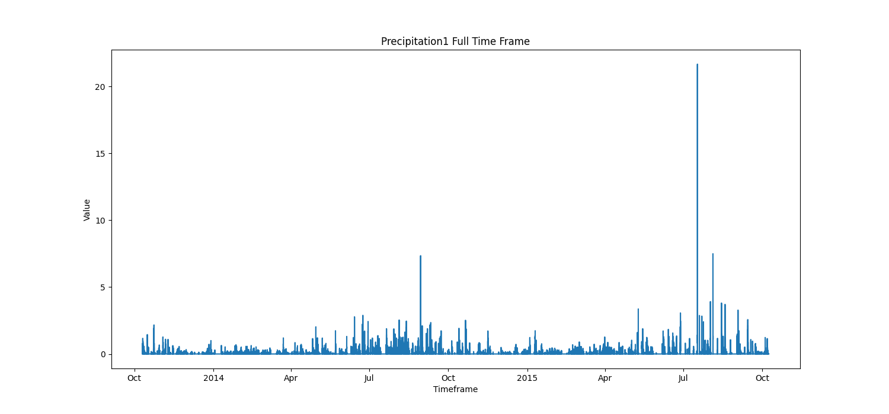
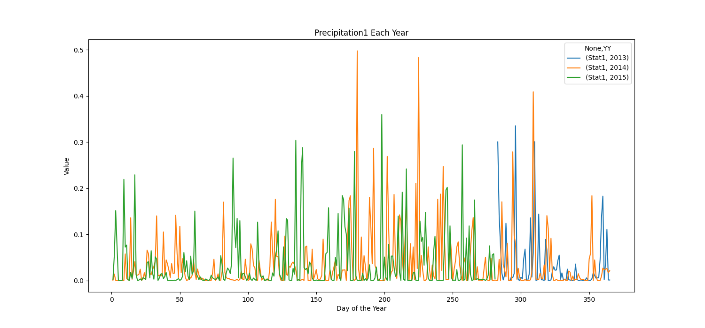
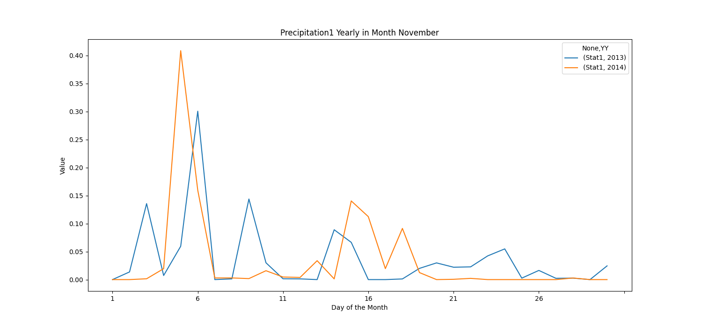

## SETUP

To install all dependencies, run ``pip install -r requirements.txt`` in this folder.

### Prepare Files

Use the Script ``prepare_files.py`` to prepare files for transformation.

Run ``prepare_files.py -i DIR`` with ``DIR`` being the path to your raw data files.

Use the argument ``-o`` if you want to override existing config files. It defaults to False,
so if a new set of data from the same station is transformed (and the input files are named the same)
it will keep the existing config for that station.

Run ``prepare_files.py --help`` to get help.

Example:
````pycon
prepare_files.py -o -i C:/Users/user/Desktop/source_files 
````
This example will get all files located in the folder ``source_files`` on the desktop and prepare them.
Since the override Flag is set to ``True``, it will override all config if they already exist in the input folder.

The script will accept ``.csv`` and ``.zrx`` files in the source directory.

The script will
1. Create an ``input`` and an ``output`` folder.
2. Copy all ``.zrx`` and ``.csv`` files from your specified source folder to the input folder.
3. Convert all ``.zrx`` files to ``.csv``.
4. Encode all files as ``utf-8``.
5. Create a default config file for each dataset.

Modify the config files to your needs before running the ``transform_data.py`` script.

### Config

Specify the required configuration in the config.txt for each csv file.
The default config looks like this:
````
[station]
name=unknown  ==> (string) specify the name of the station where the data was collected
elevation=0  ==> (float) specify the elevation of the station
latitude=0  ==> (string) specify the latitude of the station
longitude=0  ==> (string) specify the longitude of the station

[data]
skip_first_n=10	==> (integer, min=1) specify how many rows at the start of the file should be skipped. Skip at least all header rows.
modify_values=False	==> (boolean, True | False) specify if a modifier should be applied to the value column
interval_minutes=1	==> (integer, min=1) specify the interval in minutes for the modifier
modifier=sum ==> (string, sum | mean) mean => get the average of the interval, sum => get the sum of the interval
replace_nan_values=False  ==> (boolean, True | False) specify if values should be replaced
nan_value_identifier=-	==> (list | -) which value should be replaced? '-' replaces all negative values or a comma seperated list of floats (e.g. 7.3, -7.3)
nan_value_replacement=0	==> (integer | NaN) integer value to replace NaN values with or 'NaN' to replace with NaN
````
### Transform files

Run the script ``transform_data.py`` to transform the files to the required format.
The Script will:
1. Get all ``.csv`` files from the input folder that was created from ``prepare_files.py``.
2. For each file:
   1. Get the config of the file
   2. Parse the timestamp to the format YY | MM | DD | HH | MM
   3. Apply the modifier if specified in the config
   4. Create a header containing the station data
   5. Save the transformed file as ``txt`` in the output folder


### Plot files

Run the script ``plotter.py -f FILES`` to plot the data. ``FILES`` can be ``all`` to plot all files
in the output folder or a list of file names in the folder. E.g.:

``plotter.py -f all`` plots all files in the output folder.

``plotter.py -f File1 File2`` plots the files ``File1`` and ``File2`` in the output folder.

Run ``plotter.py --help`` to get a list of all available commands.

By default, a graph of the entire data will be plotted:


You can specify these additional parameters:

``plotter.py -y`` to plot a graph with all yearly data overlayed:


``plotter.py -m INT | all`` with ``INT`` being a number from 1-12 that identifies a month or ``all`` to plot
a graph for each month with yearly data overlayed:



